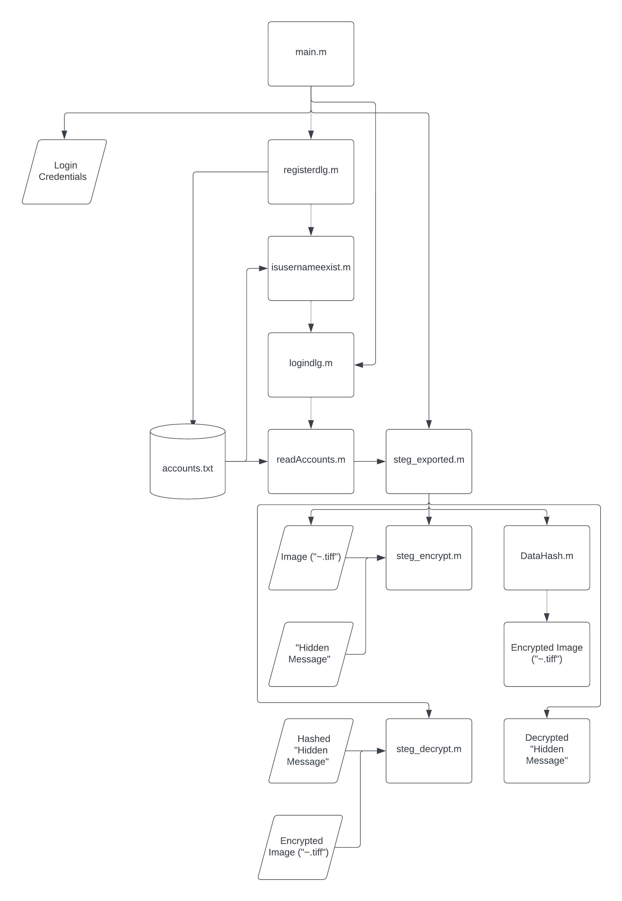
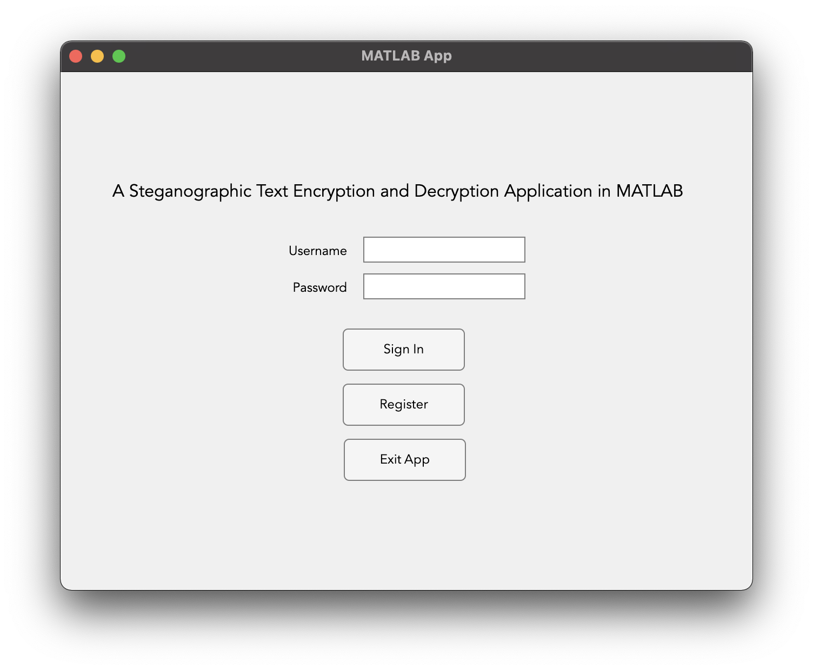
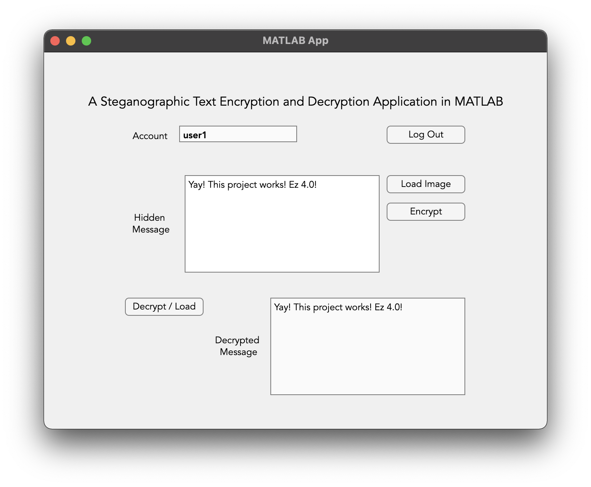

# **A Steganographic Text Encryption and Decryption Application in MATLAB**

## A fully functional MATLAB application that can encrypt and decrypt text using steganography.

- [Overview](#overview)
- [Files](#files)
- [Features](#features)
  * [Main Features](#main-features)
  * [Additional Features](#additional-features)
  * [Error Handling Features](#error-handling-features)
  * [Additional Possible Features (For Developers)](#additional-possible-features--for-developers-)
- [Bugs](#bugs)
- [Installation](#installation)
- [Usage](#usage)
- [Compatibility](#compatibility)
- [Documentation](#documentation)
- [Contributing](#contributing)
- [License](#license)

##### *Build Number: 2023.04.10.1.0*
# **Overview**
###### ***DISCLAIMER:*** *This project is for educational purposes only. The authors are not responsible for any misuse of the application.*

This project was created as a partial fulfillment of the requirements for the course **LBYEC4A - Signals, Spectra, and Signal Processing Laboratory** at **De La Salle University - Manila**. Every line of code was written by **Team Aquaman**, composed of [**Rocelle Belandres**](), [**Jelo Laca**](), and [**Keane Sulit**](https://www.linkedin.com/in/keane-sulit/). It was supervised by [**Ramon Stephen L. Ruiz**](https://www.linkedin.com/in/r-stephen-ruiz-8302712b/).

The project was created using MATLAB R2022b/R2023a, and is a fully functional application that can encrypt and decrypt text using steganography. The application can be used to hide text messages in images, and can also be used to extract hidden text messages from images. The application is also unique to a specific user, as it uses MD5 hashing to hash the user's credentials as a key to encrypt and decrypt the text.

The hierarchy chart of the application is shown below:

# **Files**
The project has the following files:
- `main.m` - The main script of the application. It runs the GUI of the login and registration page.

- `steg.m` - The script that allows the user to encrypt and decrypt text using image-based steganography.

- `encrypt.m` - The script that encrypts text using steganography.

- `decrypt.m` - The script that decrypts hidden text using steganography.

- `login.m` - The script that allows the user to login to the application.

- `register.m` - The script that allows the user to register to the application.

- `isusernameexist.m` - The script that checks if the username entered by the user already exists in the application.

- `DataHash.m` - The script that hashes the user's credentials to be used as a key to encrypt and decrypt the text. This script was taken from [here](https://www.mathworks.com/matlabcentral/fileexchange/31272-datahash).

- `lena_std.tiff` - The image used to demonstrate the application.

- `account.txt` - The text file that stores the user's credentials. This file is updated when the user registers to the application.

# **Features**
The application has the following features:

## Main Features
- Encrypts text using steganography
- Decrypts hidden text using steganography

## Additional Features
- Allows the user to register to the application
- Allows the user to login to the application
- Unique to a specific user
- Uses MD5 hashing to hash the user's credentials as a key to encrypt and decrypt the text
- Saves the user's credentials in a text file
## Error Handling Features
- Checks if the username entered by the user already exists in the application
- Checks if the user entered the correct credentials when logging in
- Checks if the user entered the correct credential requirements when registering
- Checks if the user has access to decrypt the text in the image

## Additional Possible Features (For Developers)
- Allows the user to change the password
- Allows the user to delete the account
- Allows the user to delete their past encryptions
- Allows the user to save the encrypted text in a text file
- Improve the GUI
- Improve the error handling features
- Improve dialog boxes (currently uses MATLAB's default dialog boxes)

*Note: The additional possible features are not included in the project.*

# **Bugs**
The application has the following bugs:
- When loading an image file with an existing encrypted text, the application proceeds to load the image. An error should be thrown instead.
# **Installation**
To install the application, clone the repository or download as a `.zip` file. 

# **Usage**
To use the application, Rrun the `main.m` file in a MATLAB script. It can also be run directly in the MATLAB command window.

# **Compatibility**
The application is compatible with MATLAB R2022b/R2023a.

The application can load images in the following formats:
- `.tiff`
- `.jpg`
- `.png`
- `.bmp`

The maximum text length that can be encrypted will depend on the image size and the image format since the application uses the LSB method to hide the text in the image. The maximum text length can be calculated using the following formula:

`max_text_length = (image_width * image_height * 3) / 8`

where:
- `max_text_length` is the maximum text length that can be encrypted.
- `image_width` is the width of the image in pixels.
- `image_height` is the height of the image in pixels.
- `3` is the number of color channels in the image (R, G, and B).
- `8` is the number of bits in a byte.

## ***Warnings***
1. The application will not be able to encrypt and decrypt text if the text length exceeds the maximum text length.

2. The application will not encrypt and decrypt text if the image is not in the correct format.

3. The application will only work for images in the RGB color space.

4. All necessary files must be in the same folder.

# **Documentation**
The full documentation of the project can be found [here]().
A demonstration of the application can be found [here]().

Demo video:

# **Contributing**
If you wish to contribute to the project, fork the repository and create a pull request or email the authors at the following email addresses:
- Rocelle Belandres - `rocelle_andrea_belandres@dlsu.edu.ph`
- Jelo Laca - `jean_lenard_laca@dlsu.edu.ph`
- Keane Sulit - `keane_sulit@dlsu.edu.ph`

# **License**
This project has no license. 
